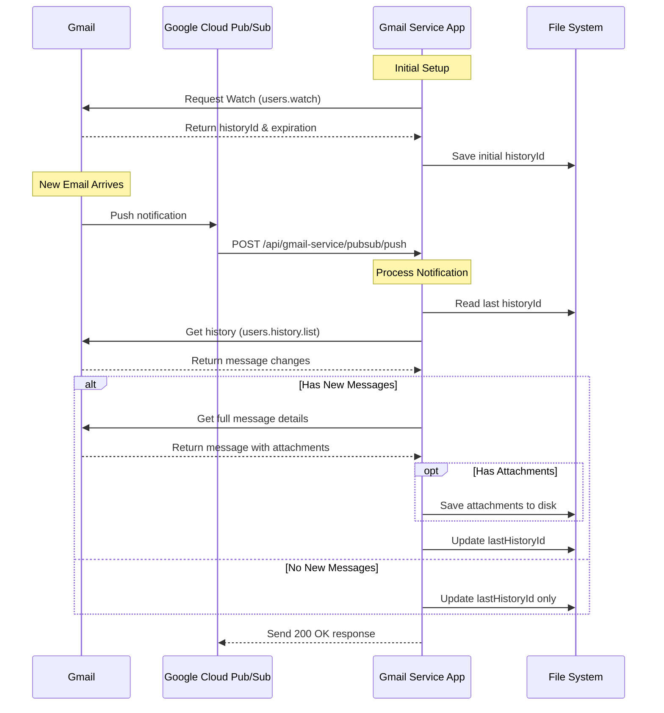

# Gmail Service POC

A proof of concept service for integrating with Gmail API.

## Overview

This project demonstrates a serverless application that integrates with the Gmail API to process email notifications in real-time. It uses Google Cloud Pub/Sub for push notifications and provides functionality to fetch, process, and store email data, including attachments. The application is built with TypeScript and Express, and it leverages the Serverless Framework for deployment.

Key features include:
- Real-time email notifications using Gmail API and Pub/Sub
- OAuth2 authentication for secure access to Gmail
- History tracking to process only new emails
- Attachment handling and storage
- Serverless architecture for scalability and cost efficiency

## Installation

1. Clone the repository:
```bash
git clone <repository-url>
cd poc-gmailservice
```

2. Install dependencies:
```bash
npm install
```

3. Set up environment variables:
```bash
cp .env.example .env
```
Edit `.env` file with your Gmail API credentials.

## Usage

```bash
npm start
```

## Project Structure

```
poc-gmailservice/
├── src/
│   ├── config/      # Configuration files
│   ├── services/    # Service implementations
│   ├── types/       # TypeScript type definitions
│   └── index.ts     # Main entry point
├── tests/           # Test files
└── README.md        # This file
```

## Configuration Files

### credentials.json
This file contains your Google Cloud Project credentials. You need to:
1. Go to Google Cloud Console
2. Create a project or select existing one
3. Enable Gmail API
4. Create OAuth 2.0 credentials
5. Download the credentials and save as `credentials.json` in project root

Example structure:
```json
{
  "installed": {
    "client_id": "your-client-id.apps.googleusercontent.com",
    "project_id": "your-project-id",
    "auth_uri": "https://accounts.google.com/o/oauth2/auth",
    "token_uri": "https://oauth2.googleapis.com/token",
    "auth_provider_x509_cert_url": "https://www.googleapis.com/oauth2/v1/certs",
    "client_secret": "your-client-secret",
    "redirect_uris": ["http://localhost:5000/oauth2callback"]
  }
}
```

### token.json
Generated after successful OAuth2 authentication. Contains access and refresh tokens.
Example structure:
```json
{
  "access_token": "ya29.a0AbVbY6P...",
  "refresh_token": "1//04uX9K...",
  "scope": "https://www.googleapis.com/auth/gmail.readonly",
  "token_type": "Bearer",
  "expiry_date": 1653012345678
}
```

### lastHistoryId.json
Stores the last processed Gmail history ID to track email changes. Created and updated automatically.
Example structure:
```json
{
  "historyId": "1587019"
}
```

## Important Notes

- Never commit `credentials.json`, `token.json`, or `lastHistoryId.json` to version control
- Keep these files secure as they contain sensitive authentication information
- Backup `credentials.json` securely as it's needed to regenerate tokens
- If `lastHistoryId.json` is lost, the service will restart tracking from the next received message
- The `token.json` will be automatically refreshed when expired

## Gmail Notification Process



### Process Explanation

1. **Initial Setup**
   - App authenticates with Gmail API
   - Registers for push notifications using users.watch
   - Stores initial historyId

2. **Email Reception**
   - Gmail detects new email
   - Triggers notification to Google Cloud Pub/Sub
   - Pub/Sub forwards to our webhook endpoint

3. **Notification Processing**
   - App receives Pub/Sub notification
   - Retrieves last processed historyId
   - Fetches changes since last historyId
   - Downloads and processes new messages
   - Saves attachments if present
   - Updates lastHistoryId for next sync

## Contributing

1. Fork the repository
2. Create your feature branch (`git checkout -b feature/amazing-feature`)
3. Commit your changes (`git commit -m 'Add some amazing feature'`)
4. Push to the branch (`git push origin feature/amazing-feature`)
5. Open a Pull Request

## License

This project is licensed under the MIT License - see the LICENSE file for details.
